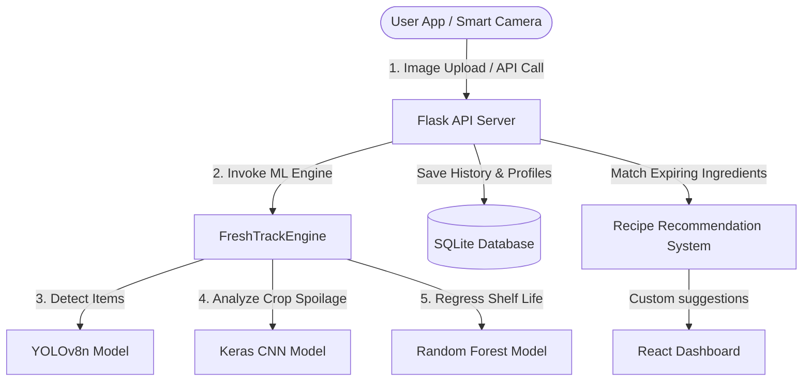

# 🍏 FreshTrack: AI-Powered Food Freshness Tracking & Recipe System

FreshTrack is an intelligent, real-time food preservation and management system. By combining computer vision object detection, deep learning freshness analysis, environmental telemetry, and dynamic recipe recommendations, FreshTrack helps users minimize food waste and optimize their refrigerator's contents.

---

## 🚀 Key Features

* **Centralized ML Pipeline**:
  * **YOLOv8n Object Detection**: Recognizes food items (like Apples, Lemons, Tomatoes) and crops individual items dynamically.
  * **Keras CNN Freshness Predictor**: Analyzes cropped images to calculate freshness percentages.
  * **Random Forest Shelf Life Estimator**: Estimates remaining shelf life using custom parameters like freshness score, storage temperature, humidity, and gas resistance.
* **Smart Dashboard & Telemetry**:
  * Live monitoring of temperature, humidity, and gas sensor resistance.
  * System alerts for items spoiling or expiring within 2 days.
* **Indian Recipe Recommendation Engine**:
  * Suggests curated recipes (e.g., Tomato Rasam, Lemon Rice, Apple Halwa) using expiring ingredients to encourage zero waste.
* **Interactive Frontend UI**:
  * Built using React 19, Tailwind CSS v4, and Framer Motion.
  * Sleek animations, live status indicators, and responsive dashboard layouts.
* **User Authentication**:
  * Hashed passwords using `bcrypt` and sqlite3 storage for profile personalization.

---

## 🛠️ Technology Stack

| Layer | Technologies |
| :--- | :--- |
| **Frontend** | React 19, Vite, Tailwind CSS v4, Framer Motion, Lucide Icons |
| **Backend** | Flask (Python), SQLite3, Bcrypt |
| **Machine Learning** | TensorFlow, Keras, Ultralytics YOLOv8n, Joblib, NumPy, Pillow |

---

## 📊 System Architecture



---

## 📂 Project Structure

```text
├── backend/
│   ├── models/                # Pre-trained ML weights (YOLO, CNN, Random Forest)
│   ├── images/                # Uploaded scans and cropped items
│   ├── RECIPE IMAGES/         # Asset images for recipe recommendations
│   ├── api.py                 # Flask server main endpoints
│   ├── database.py            # SQLite database schema, CRUD, and session management
│   ├── ml_engine.py           # Core ML inference engine (FreshTrackEngine)
│   ├── requirements.txt       # Backend dependencies
│   └── venv/                  # Python Virtual Environment
└── frontend/
    └── Webpage/               # Vite React SPA
        ├── src/
        │   ├── components/    # Reusable UI widgets (cards, panels, graphs)
        │   ├── pages/         # Dashboard, Analytics, Profile, Auth
        │   └── App.jsx        # Routing and entry logic
        ├── package.json
        └── tailwind.config.js
```

---

## ⚙️ Setup & Installation

### Prerequisite
Ensure you have **Python 3.10+** and **Node.js (v18+)** installed.

---

### 🐍 1. Backend Setup

1. Navigate to the backend directory:
   ```bash
   cd backend
   ```
2. Activate your Virtual Environment:
   * **Windows (PowerShell):**
     ```powershell
     .\venv\Scripts\Activate.ps1
     ```
   * **Windows (Command Prompt):**
     ```cmd
     .\venv\Scripts\activate.bat
     ```
   * **macOS/Linux:**
     ```bash
     source venv/bin/activate
     ```
3. Install dependencies:
   ```bash
   pip install -r requirements.txt
   ```
4. Launch the API server:
   ```bash
   python api.py
   ```
   The backend will initialize the database and run locally at `http://127.0.0.1:5000`.

---

### ⚛️ 2. Frontend Setup

1. Navigate to the frontend webpage folder:
   ```bash
   cd frontend/Webpage
   ```
2. Install dependencies:
   ```bash
   npm install
   ```
3. Run the Vite development server:
   ```bash
   npm run dev
   ```
   The user interface will be served at `http://localhost:5173`.

---

## 📡 Core API Endpoints

| Endpoint | Method | Description |
| :--- | :--- | :--- |
| `/upload` | `POST` | Uploads food scanning image, runs ML pipelines, and updates global fridge state. |
| `/api/recipes` | `GET` | Generates recipe recommendations prioritizing items close to expiration. |
| `/api/environment`| `GET` | Fetches temperature, humidity, and gas resistance metrics. |
| `/api/inventory` | `GET` | Returns list of tracked items in the refrigerator. |
| `/api/alerts` | `GET` | Lists expiring or spoiled items. |
| `/login` / `/register` | `POST` | User onboarding and authentication endpoints. |

---

## 📄 License
This project is for educational and mini-project purposes. All rights reserved.

## 👥 Team Project Acknowledgement

FreshTrack was developed as a collaborative college mini project by a team of students. This fork highlights my individual contributions while acknowledging the efforts of the entire team.

### 👩‍💻 My Contributions

I was primarily responsible for designing, training, and integrating the machine learning models used in FreshTrack. My contributions include:

- Trained the **YOLOv8n object detection model** using a custom dataset prepared and managed with **Roboflow**.
- Designed, trained, and evaluated the **CNN-based freshness prediction model** using **TensorFlow/Keras** on **Google Colab**.
- Developed and trained the **Random Forest shelf-life prediction model** for estimating the remaining shelf life of detected food items.
- Performed dataset preparation, image annotation, preprocessing, model training, evaluation, and hyperparameter tuning to improve model performance.
- Integrated the trained machine learning models into the FreshTrack pipeline for real-time food detection, freshness prediction, and shelf-life estimation.
